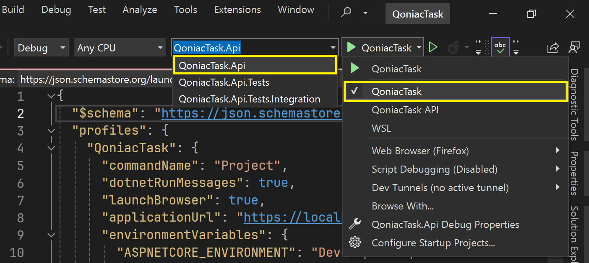

# Qoniac/KLA Task

## Requirements

- .NET 6 SDK
- Node 20.12.x or above

## How to run

- Run using the terminal
    - Go to `src\qoniactask.client` and run `npm install` to initialize it.
    - Go to the `src\QoniacTask.Api` directory and run `dotnet run` to start the API.
    - Open up `https://localhost:7225` and it should start the UI as well.
    - Server swagger page is available at `https://localhost:7225/swagger`.

- Run using Visual Studio
    - Choose `QoniacTask.Api` as the start up project
    - Choose `QoniacTask API` as the profile
    - Start :)
    